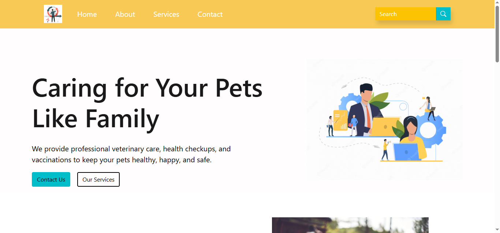

# 🐾 Veterinary Care Website (Bootstrap Project)

A responsive veterinary clinic website built using HTML, CSS, and Bootstrap 5.  
This project was developed as a classroom practice project to learn Bootstrap grid system, components, and responsive design.

---

## 📷 Project Preview

## 📷 Project Preview

---

## 🚀 Features

- Responsive Navigation Bar
- Hero Banner Section
- Services Section
- Counter Section
- Blog / Articles Section
- Professional Footer with Subscription Form
- Bootstrap Icons Integration
- Fully Responsive Layout

---

## 🛠️ Technologies Used

- HTML5
- CSS3
- Bootstrap 5
- Bootstrap Icons

---

## 📱 Responsive Design

The layout adapts to:
- Desktop
- Tablet
- Mobile devices

---

## 🎯 Purpose of This Project

This project was created to practice:

- Bootstrap Grid System
- Responsive Design
- Layout structuring
- Custom CSS with Bootstrap
- Navbar and Footer design

---

## 👨‍💻 Author

Avinash Kale  
Computer Science Student
